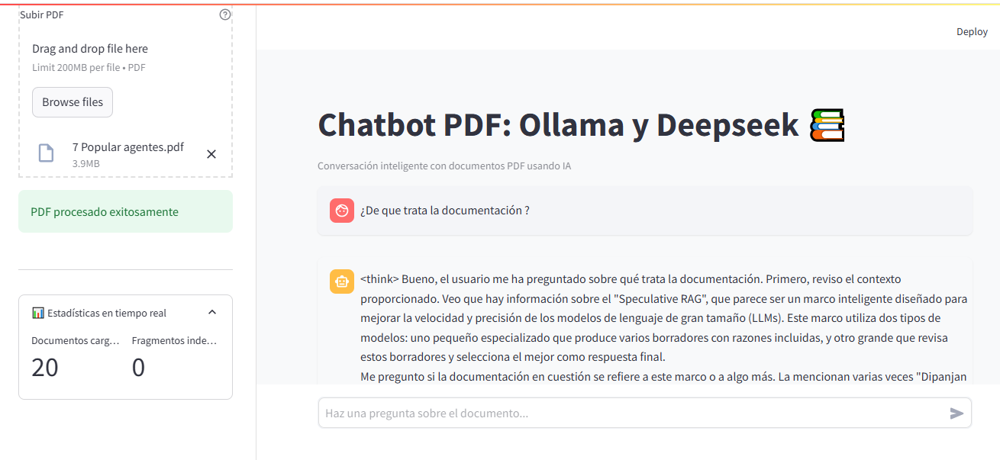

# ChatPDF Inteligente: Chatbot PDF con Ollama y Deepseek 🤖



**ChatPDF Inteligente** es una aplicación de chatbot avanzada que te permite interactuar de manera conversacional con tus documentos PDF. Utilizando el poder de **Ollama** y el modelo de lenguaje **Deepseek**, esta herramienta implementa la técnica de **Recuperación y Generación Aumentada (RAG)** para ofrecerte respuestas precisas y contextualizadas en español a tus preguntas sobre el contenido de tus PDFs.

Ideal para investigadores, estudiantes, profesionales y cualquier persona que necesite extraer información clave de documentos PDF de forma rápida y eficiente en local.

## ✨ Características Principales

* **Interfaz de Chat Intuitiva:**  Sube tu PDF y comienza a chatear con él como si fuera una persona.
* **Respuestas Precisas con RAG:** La arquitectura RAG asegura que las respuestas se basen en el contenido relevante del PDF, evitando alucinaciones y mejorando la precisión.
* **Modelo de Lenguaje Deepseek:**  Utiliza el modelo **deepseek-r1:8b** de Ollama para generar respuestas coherentes y de alta calidad en español.
* **Fácil Instalación:** Configuración sencilla con instrucciones paso a paso para que puedas empezar a usarlo rápidamente.
* **Código Abierto:**  El código de la aplicación es completamente abierto y disponible en GitHub para que puedas revisarlo, modificarlo y contribuir.
* **Estadísticas en Tiempo Real:**  Monitorea la cantidad de documentos cargados y fragmentos indexados directamente en la interfaz de Streamlit.

## 🚀 ¿Cómo Funciona? - Recuperación y Generación Aumentada (RAG)

**ChatPDF Inteligente** utiliza la técnica RAG para combinar lo mejor de la búsqueda de información y la generación de lenguaje:

1. **Recuperación:**
    * **Carga del PDF:** Permite subir archivos PDF a través de la interfaz de Streamlit.
    * **Fragmentación del Texto:** Divide el contenido del PDF en fragmentos de texto manejables utilizando `PDFPlumberLoader` y `RecursiveCharacterTextSplitter`.
    * **Generación de Embeddings:** Convierte los fragmentos de texto en embeddings vectoriales utilizando el modelo **deepseek-r1:8b** de Ollama.
    * **Indexación en ChromaDB:** Almacena los embeddings en una base de datos vectorial `ChromaDB` para una búsqueda semántica eficiente.

2. **Generación:**
    * **Búsqueda Semántica:** Cuando haces una pregunta, el sistema busca los fragmentos de texto más relevantes en `ChromaDB` utilizando similitud de embeddings.
    * **Generación de Respuesta:**  Utiliza el modelo de lenguaje **deepseek-r1:8b** de Ollama para generar una respuesta clara y concisa en español, basada en el contexto de los fragmentos recuperados.
    * **Interfaz de Chat:** Muestra la pregunta y la respuesta en una interfaz de chat interactiva en Streamlit.

## 🛠️ Instalación y Configuración

### Requisitos Previos

* **Python 3.8 o superior** 🐍
* **Ollama instalado** y el modelo **deepseek-r1:8b** descargado 🧠.  Descarga Ollama desde [https://ollama.com/](https://ollama.com/) y el modelo `deepseek-r1:8b` desde [https://ollama.com/library/deepseek-r1).
* **Visual C++ Build Tools** (solo para Windows): Necesario para algunas dependencias de Python. Descárgalas desde [https://visualstudio.microsoft.com/es/visual-cpp-build-tools/](https://visualstudio.microsoft.com/es/visual-cpp-build-tools/).

### Pasos de Instalación

1. **Clonar el Repositorio:**
   ```bash
   git clone https://github.com/RickyFer22/ChatPDF-Inteligente-Chatbot-PDF-con-Ollama-y-Deepseek.git
   cd ChatPDF-Inteligente-Chatbot-PDF-con-Ollama-y-Deepseek
   ```

2. **Crear un Entorno Virtual (Recomendado):**
   ```bash
   python -m venv entorno
   ```

3. **Activar el Entorno Virtual:**
   * **Windows:**
     ```bash
     entorno\Scripts\activate
     ```
   * **macOS/Linux:**
     ```bash
     source entorno/bin/activate
     ```

4. **Instalar Dependencias:**
   ```bash
   pip install -r requirements.txt
   ```

5. **Descargar el Modelo Ollama:**
   Asegúrate de tener Ollama instalado y luego descarga el modelo **deepseek-r1:8b**:
   ```bash
   ollama pull deepseek-r1:8b
   ```

## 📂 Estructura del Proyecto

```
chatpdf-inteligente/
├── app.py                # Código principal de la aplicación Streamlit
├── requirements.txt      # Lista de dependencias de Python
├── README.md             # Documentación del proyecto (este archivo)
├── ollama.png            # Imagen del logo de Ollama
├── pdfs/                 # Carpeta para almacenar PDFs subidos por el usuario
└── vectordb/             # Carpeta para la base de datos vectorial ChromaDB
```

## 🚀 Ejecución de la Aplicación

1. **Activar el Entorno Virtual** (si no lo has hecho ya):
   * **Windows:**
     ```bash
     entorno\Scripts\activate
     ```
   * **macOS/Linux:**
     ```bash
     source entorno/bin/activate
     ```

2. **Ejecutar la Aplicación Streamlit:**
   ```bash
   streamlit run app.py
   ```

3. **Abrir en el Navegador:**
   La aplicación se abrirá automáticamente en tu navegador en `http://localhost:8501`. Si no, abre este enlace manualmente.

## 📜 Licencia

Este proyecto está licenciado bajo la Licencia MIT. Consulta el archivo `LICENSE` para más detalles.

## 🙏 ¡Contribuciones Bienvenidas!

Si encuentras errores, tienes sugerencias de mejora o quieres añadir nuevas funcionalidades, ¡no dudes en contribuir! Abre un issue o envía un pull request en el repositorio de GitHub.

---

<p align="center" style="text-align: center; color: #6C757D; padding: 1rem;">
    Sistema de análisis documental v3.2 |
    <a href="https://github.com/RickyFer22" style="color: #6C757D;">GitHub</a> |
    <a href="https://www.linkedin.com/in/ricardo-fernández00/" style="color: #6C757D;">LinkedIn</a>
</p>

¡Gracias por usar ChatPDF Inteligente! 😊
